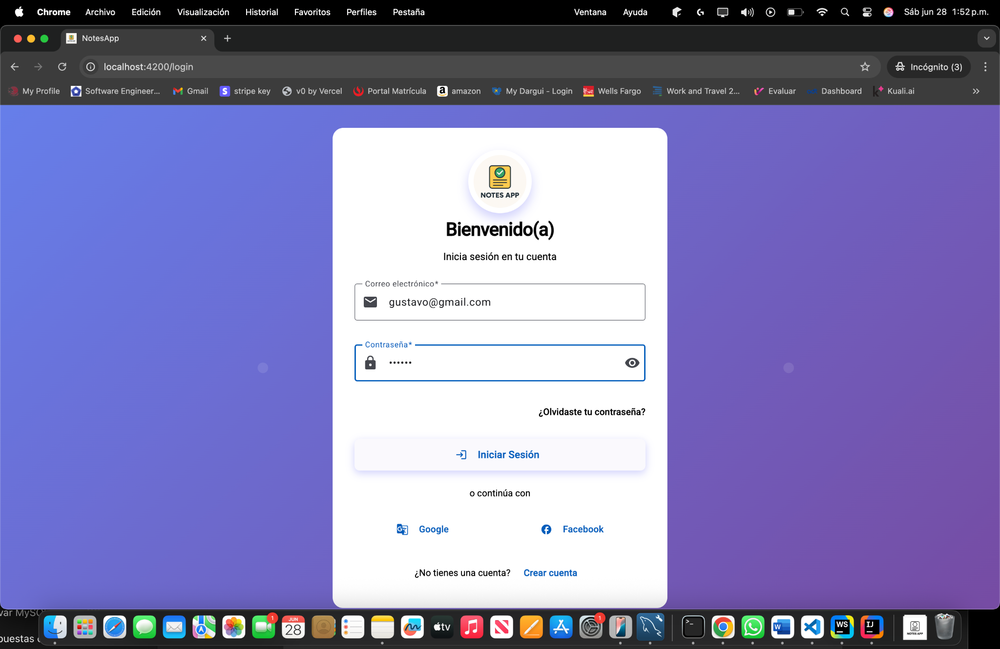
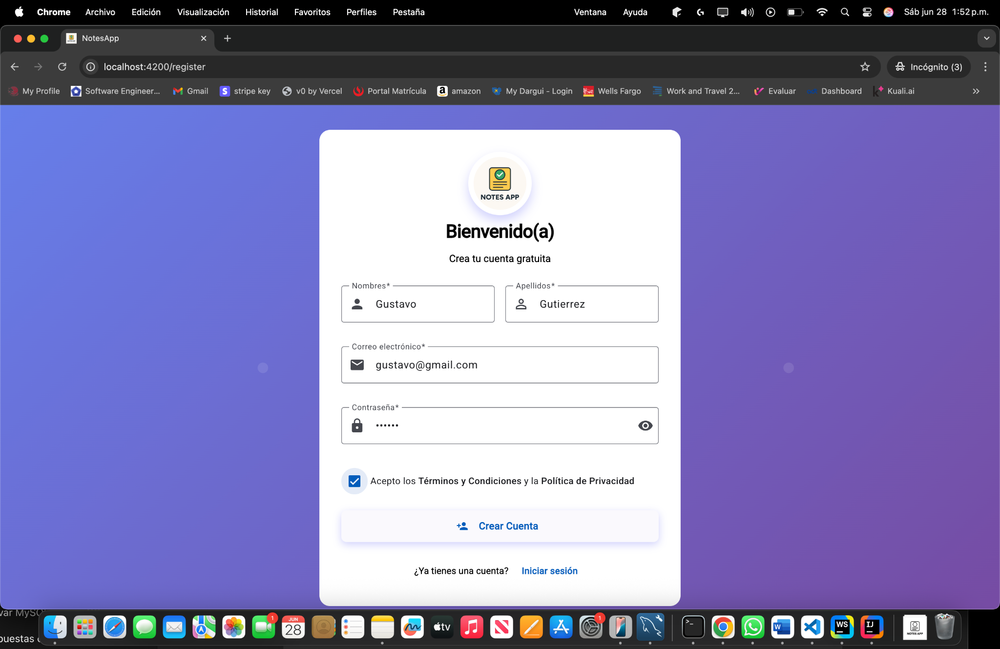
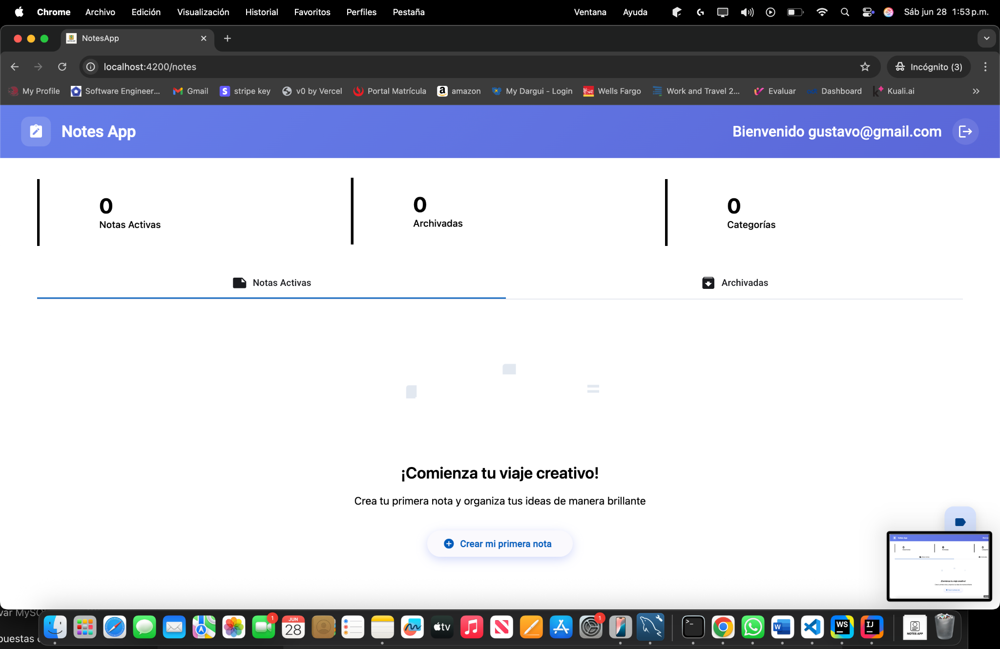
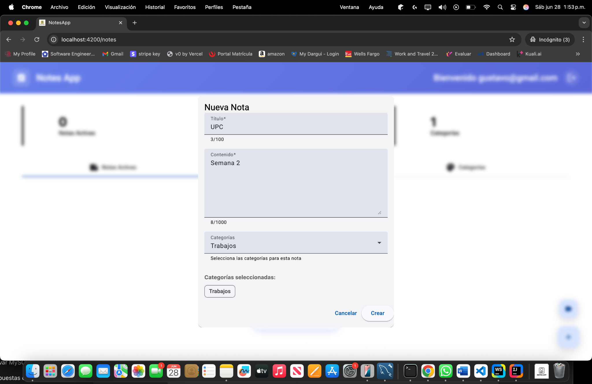
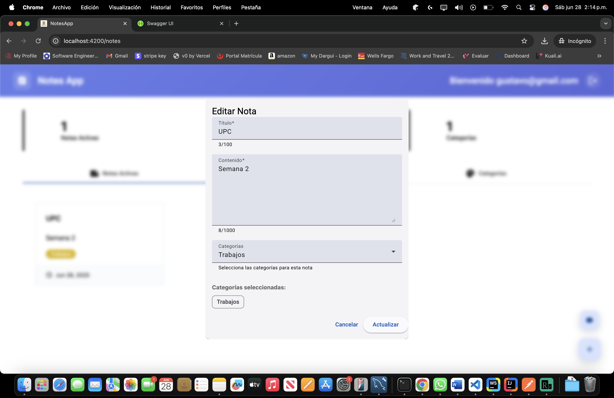
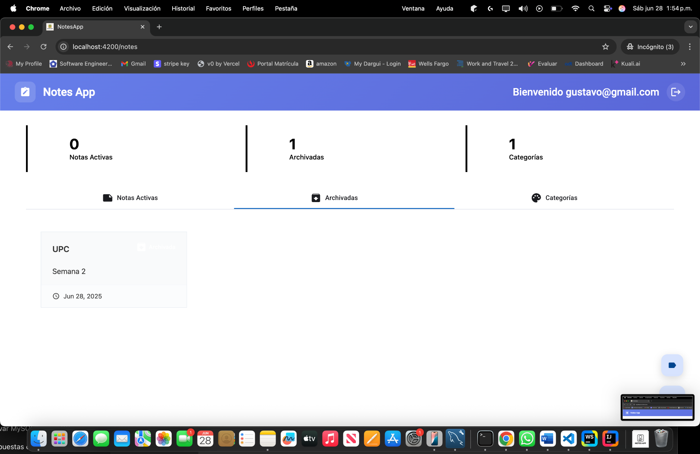
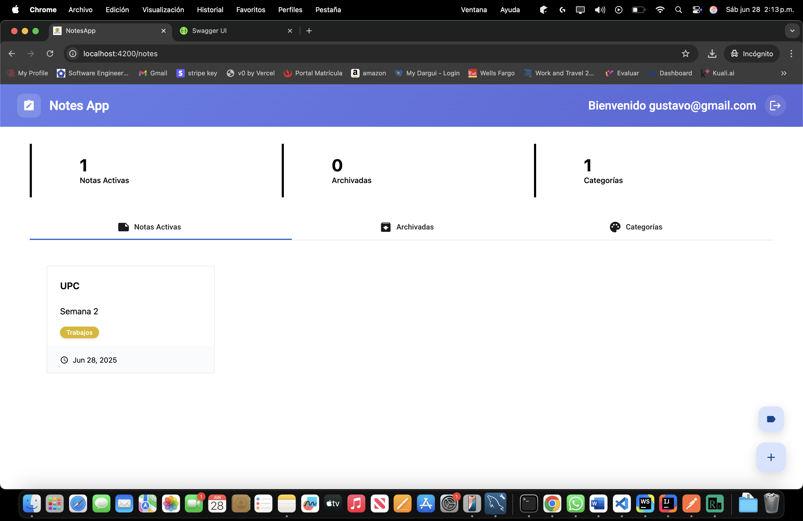
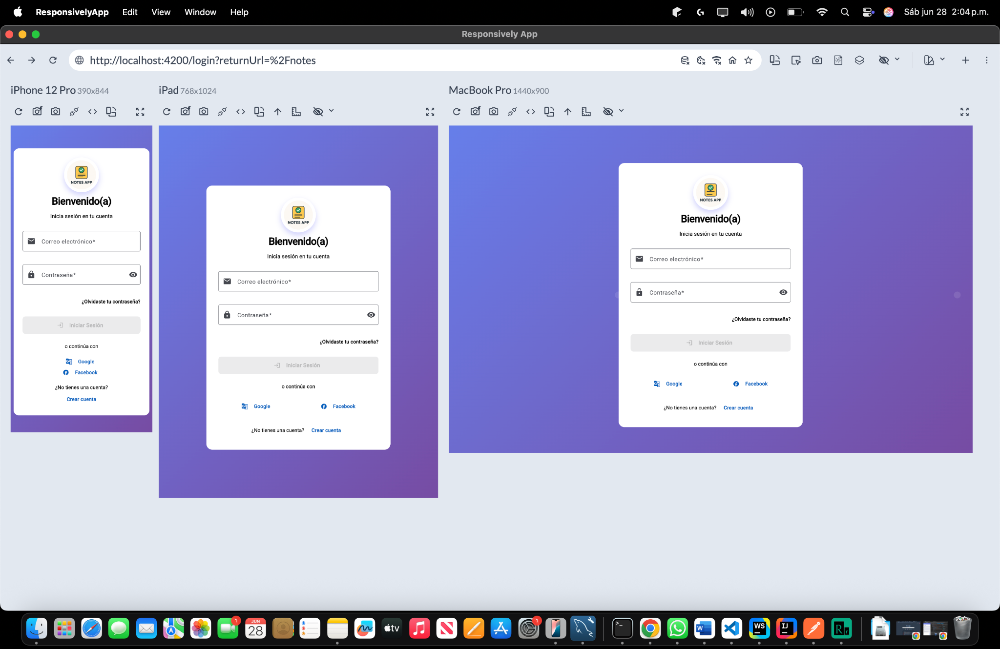
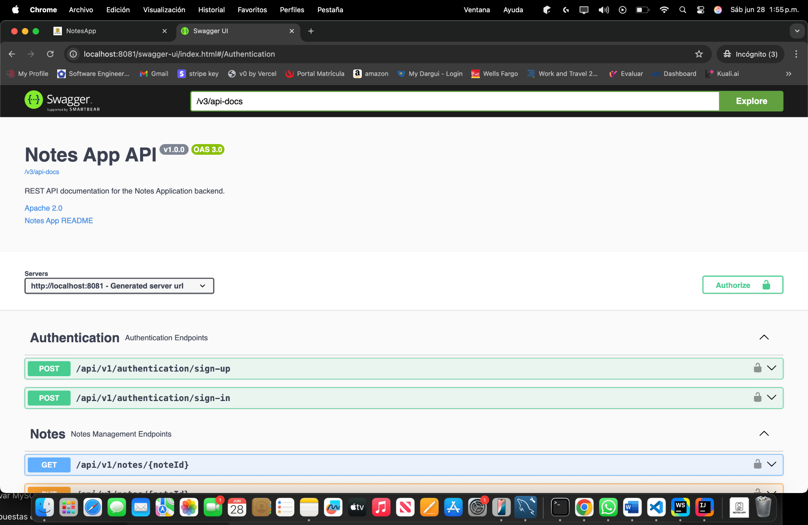
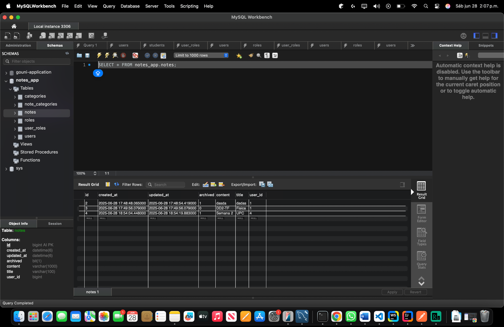

# 📝 **Notes App**

A **full‑stack** notes‑management application built with **Spring Boot** (backend) and **Angular** (frontend), following **hexagonal architecture** and **Domain‑Driven Design (DDD)**.


---

## 🚀 Main Features

| Module                    | Description                                       |
| ------------------------- | ------------------------------------------------- |
| 🔐 **JWT Authentication** | Secure user registration, login and token refresh |
| 📝 **Notes Management**   | Create, edit, archive and delete notes            |
| 🏷️ **Categories**        | Group notes with custom colours                   |
| 🔍 **Search**             | Real‑time filter by title or body                 |
| 📱 **Responsive Design**  | Optimised for desktop, tablet and mobile          |
| 🎨 **Angular Material**   | Modern UI based on Material Design                |

---

## 📸 Screenshots

> Image paths follow the structure described in **📁 Screenshots Folder**.

| View                | Preview                                          |
| ------------------- | ------------------------------------------------ |
| **Login**           |            |
| **Register**        |      |
| **Dashboard**       |         |
| **Create Note**     |          |
| **Edit Note**       |              |
| **Categories**      |  |
| **Archived**        |     |
| **Category Filter** |      |
| **Mobile View**     |          |
| **Tablet View**     |          |
| **Swagger UI**      |         |
| **ER Model**        |          |

---

## 📋 Prerequisites

| Tool                     | Minimum version |
| ------------------------ | --------------- |
| ☕ **Java**               | 21              |
| 🟢 **Node.js**           | 18              |
| 📦 **npm / pnpm / yarn** | Latest LTS      |
| 🐬 **MySQL**             | 8.0             |
| 🔧 **Maven**             | 3.8             |

---

## ⚡ Quick Start

### Option 1 — All‑in‑one Script (recommended)

```bash
chmod +x run.sh
./run.sh            # builds and starts backend + frontend
```

### Option 2 — Manual Setup

1. **Database**

```sql
CREATE DATABASE notes_app;
```

2. **Backend**

```bash
cd backend/notes-app

cp src/main/resources/application.properties.example \
   src/main/resources/application.properties   # update credentials

mvn clean install
mvn spring-boot:run         # ⇢ http://localhost:8080
```

3. **Frontend**

```bash
cd frontend/notes-app
npm install
npm start                   # ⇢ http://localhost:4200
```

---

## 🔧 Configuration

### Backend `application.properties`

```properties
# --- MySQL ---
spring.datasource.url=jdbc:mysql://localhost:3306/notes_app
spring.datasource.username=notes_user
spring.datasource.password=notes_password

# --- JPA ---
spring.jpa.hibernate.ddl-auto=update
spring.jpa.show-sql=true
spring.jpa.properties.hibernate.dialect=org.hibernate.dialect.MySQL8Dialect

# --- JWT ---
app.jwt.secret=mySecretKey
app.jwt.expiration=86400000   # 24 h
```

### Frontend `environment.ts`

```typescript
export const environment = {
  production: false,
  apiUrl: 'http://localhost:8080/api/v1'
};
```

---

## 📚 REST API

<details>
<summary>🔐 Authentication</summary>

```http
POST /api/v1/authentication/sign-in      # login
POST /api/v1/authentication/sign-up      # register
```

</details>

<details>
<summary>📝 Notes</summary>

```http
GET    /api/v1/notes                      # list all
POST   /api/v1/notes                      # create
GET    /api/v1/notes/{id}                 # get by ID
PUT    /api/v1/notes/{id}                 # update
DELETE /api/v1/notes/{id}                 # delete
PATCH  /api/v1/notes/{id}/archive         # archive
PATCH  /api/v1/notes/{id}/unarchive       # unarchive
GET    /api/v1/notes/active               # active only
GET    /api/v1/notes/archived             # archived only
GET    /api/v1/notes/search?q={query}     # search by query
```

</details>

<details>
<summary>🏷️ Categories</summary>

```http
GET    /api/v1/categories                 # list
POST   /api/v1/categories                 # create
PUT    /api/v1/categories/{id}            # update
DELETE /api/v1/categories/{id}            # delete
```

</details>

---

## 🏗️ Project Structure

```text
notes-app/
├── backend/
│   └── notes-app/
│       ├── src/main/java/org/angel/java/notesapp/
│       │   ├── iam/                  # Auth + users
│       │   ├── notes/                # Notes domain
│       │   └── shared/               # Cross‑cutting utils
│       └── src/main/resources/
├── frontend/
│   └── notes-app/
│       ├── src/app/
│       │   ├── login/
│       │   ├── register/
│       │   ├── home/
│       │   └── core/services/
│       └── public/
├── run.sh
└── README.md
```

---

## 🧪 Testing

| Layer                         | Key command                      |
| ----------------------------- | -------------------------------- |
| **Backend (JUnit + Jacoco)**  | `mvn test` / `mvn jacoco:report` |
| **Frontend (Jest + Cypress)** | `npm test` / `npm run e2e`       |

---

## 📦 Build & Deploy

| Step         | Backend                                | Frontend                          |
| ------------ | -------------------------------------- | --------------------------------- |
| **Build**    | `mvn clean package -DskipTests`        | `npm run build`                   |
| **Artifact** | `target/notes-app-1.0.0.jar`           | `dist/` folder                    |
| **Run**      | `java -jar target/notes-app-1.0.0.jar` | serve `dist/` via Nginx / Netlify |

---

## 🐳 Docker (optional)

```bash
docker build -t notes-app .
docker run -p 8080:8080 -p 4200:4200 notes-app
```

---

## 🔍 Troubleshooting

| Issue           | Quick fix                                                           |                 |
| --------------- | ------------------------------------------------------------------- | --------------- |
| ❌ DB connection | `systemctl status mysql` → check credentials                        |                 |
| ❌ Port in use   | \`lsof -ti:8080                                                     | xargs kill -9\` |
| ❌ CORS          | Add `@CrossOrigin(origins = "http://localhost:4200")` to controller |                 |

---

## 📁 Screenshots Folder

```text
screenshots/
├── auth/             # login, register, logout‑confirmation
├── notes/            # dashboard, create‑note, edit‑note, ...
├── categories/       # categories‑list, category‑filter, ...
├── features/         # archived‑notes, search‑functionality, ...
├── responsive/       # mobile‑view, tablet‑view, desktop‑view
├── api/              # swagger‑api, database‑schema, ...
├── testing/          # test‑coverage, load‑testing, performance‑metrics, ...
└── themes/           # light‑theme, dark‑theme, custom‑colours
```

---

## 📝 Screenshot Guidelines

### Best Practices

1. **Resolution**: 1920×1080 (desktop), 375×812 (mobile)
2. **Format**: PNG for maximum quality
3. **Realistic data**: avoid lorem‑ipsum
4. **Consistency**: same user account and colours everywhere
5. **Quality**: no blurry or cropped elements

### Checklist

* [ ] Login with sample data
* [ ] Dashboard with 5‑6 sample notes
* [ ] Archive and unarchive
* [ ] Filter by categories
* [ ] Add notes under a category
* [ ] “Create note” modal opened
* [ ] Edit note view
* [ ] Category list with colours
* [ ] Search with results
* [ ] Archived notes view
* [ ] Mobile responsive view
* [ ] Swagger UI endpoints
* [ ] Test results

### Recommended Tools

* **macOS**: `⌘⇧4` for selection capture
* **Windows**: Snipping Tool · `⊞+⇧+S`
* **Linux**: GNOME Screenshot · Flameshot
* **Browser**: Awesome Screenshot
* **Mobile**: Chrome DevTools emulators

---

## 🤝 Contribution

1. Fork the repository
2. `git checkout -b feature/NewFeature`
3. `git commit -m "feat: add NewFeature"`
4. `git push origin feature/NewFeature`
5. Open a **Pull Request**

---

## 📄 License

Distributed under **MIT** license. See [`LICENSE`](LICENSE.md) for details.

---

## 👤 Author

**Luis Angel Anampa Lavado**
[GitHub](https://github.com/angelpro17) · [LinkedIn](https://www.linkedin.com/in/luis-angel-anampa-lavado-a45345295/)

---

## 🙏 Acknowledgements

* Spring Boot & Spring Security
* Angular & Angular Material
* MySQL
* Jacoco, Jest, Cypress, JMeter

---

⭐ **If this project helps you, please give it a star!** ⭐
